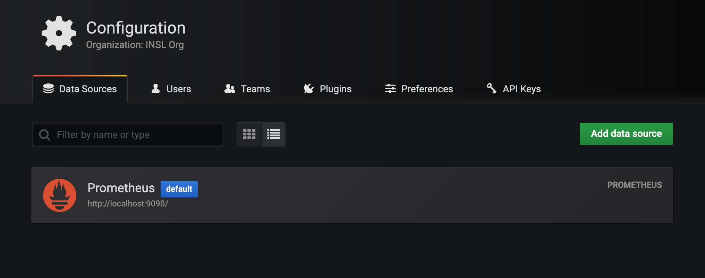
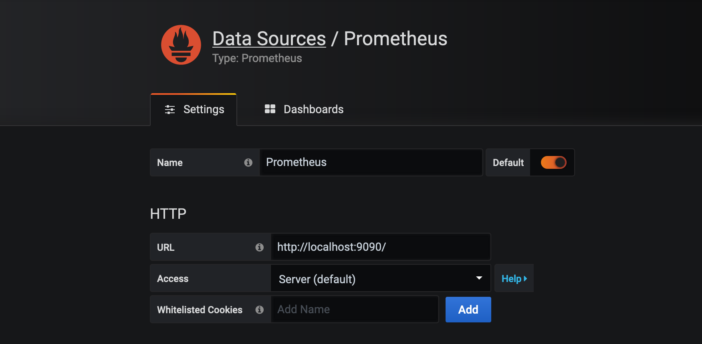
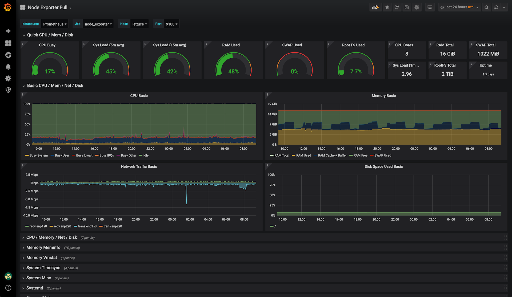
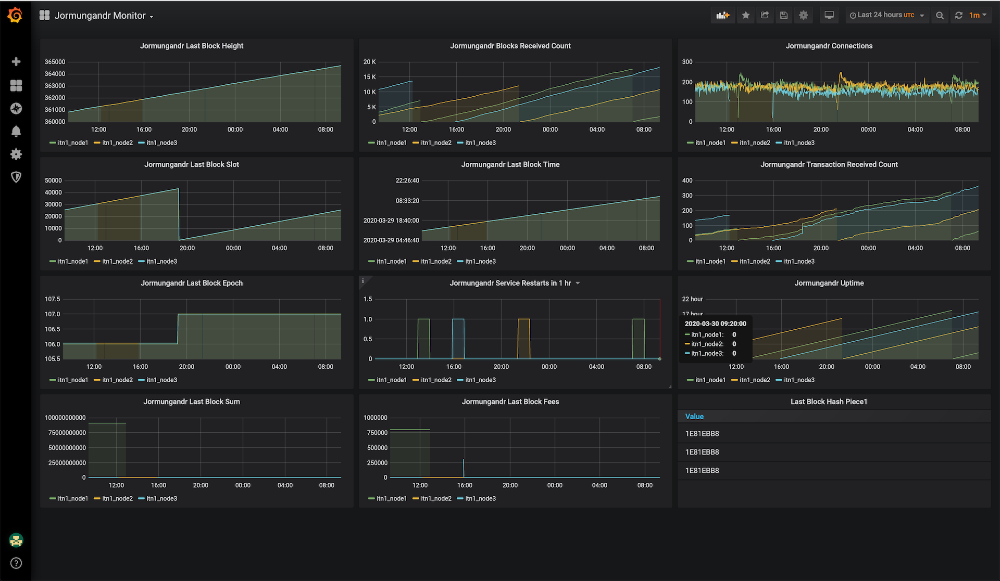

# ITN1 Cluster #

This guide builds upon, extends, and supersedes the [Not Another Cardano Guide](NACG.md). ```NACG``` focused on a single Jormungandr node. ```ITN1 Cluster``` helps you install, configure, automate and manage a three nodes cluster pool **on the same server**.

Depending on your server resources, you may want to run less (or more) nodes. Three nodes are used here, because it's what [SALAD](https://insalada.io) runs on the ITN, and have been tested in production. Better still, you could run each node on its own dedicated VPS instance, and scale up to as much as you can afford. That would require modifications to this guide and to the scripts. You are free to experiment. As much as I would love to expand the guide to multiple VPS or Docker, I can't afford to test those scenarios.

Having said that, running a *three-Jormungandr-nodes cluster* **does not mean** that you'd have three leaders running at all times. That would cause a number of issues to the network. Since you want to avoid [forks](https://pooltool.io/health), a single leader candidate node will be active at any given time. Each node starts as leader, and it's demoted on some conditions. This *multi-leader strategy* is used by many operators and, as of now, it's the best way to run multi-nodes. At least until [*the passive strategy*](https://github.com/input-output-hk/jormungandr/issues/1551) is possible.

Lastly, both this guide and installing, configuring, and managing a cluster requires a certain degree of Linux skills. And familiarity with its shell, and its commands. And that you have, at least, some experience in managing a a Linux distro.

## Assumptions ##

It would be impossible to cover every single scenario that a user could come up with, therefore this guide makes some assumptions during the process of installation and in the provided set of scripts. Examples and default values are provided, both in the guide and in the configuration files. It would still be possible for you to change the values of course. However, if unsure, sticking with the provided defaults is a safe choice. Should you decide to make changes, they should adhere to the same underlying logic of the default values. Otherwise the installation could fail or be troublesome.

## Register Your Pool ##

Before you can proceed with the cluster installation and configuration, it is necessary to register your pool ticker with the [Cardano Foundation Registry](https://github.com/cardano-foundation/incentivized-testnet-stakepool-registry). Follow [IOHK](https://github.com/input-output-hk)'s [**guide**](https://github.com/input-output-hk/shelley-testnet/blob/master/docs/stake_pool_operator_how_to.md) and use their [QA Team](https://github.com/input-output-hk/jormungandr-qa) [**scripts**](https://github.com/input-output-hk/jormungandr-qa/tree/master/scripts), to do that. The resulting ```node-secret.yaml``` and a registered pool ticker are requirements to proceed with the installation of the cluster. **Make sure to backup the generated files and keys when the IOHK guide instructs you to do so. They are vital to run a pool and to get your rewards, in due time**.

Mind that **you need to have enough tADA** - meaning ADA that were **in your wallet before the November 2019 snapshot** - otherwise you won't be able to proceed with the pool registration, and with this guide.

Come back after you have successfully completed **all** the necessary steps, and have registered your pool with the [Cardano Foundation Registry](https://github.com/cardano-foundation/incentivized-testnet-stakepool-registry). Once your pool is available on Daedalus and Yoroi (**testnet versions**), you can discard the IOHK installation to proceed with this guide and set up your cluster.

Should you need help at any stage of your pool operator journey, join the '[Cardano Shelley Testnet & StakePool Best Practice Workgroup](https://t.me/CardanoStakePoolWorkgroup)' group on Telegram; it is packed with knowledge, and great and helpful people.

**IMPORTANT: if you have already successfully created and registered your pool, you don't need to do it all over again. Just have the ```node-secret.yaml``` file handy for later.**

Should you have a ```node-secret.json```, convert it to ```node-secret.yaml``` with this tool: [https://www.json2yaml.com/](https://www.json2yaml.com/)

## ITN1 Scripts Intro ##

The following scripts are provided to take care of the pool installation, configuration and management. With the exception of ```itn1_prepare``` and ```itn1_cluster```, these run from ```root```'s ```crontab```. **These scripts will be elaborated later in the guide**.

- ```itn1_prepare```: **will help you setup the cluster while you follow the guide**.
- ```itn1_failover```: will manage the cluster leadership failover between all of the nodes.
- ```itn1_blocksbackup```: backs up the blocks files in case of need. Consider it a safety net.
- ```itn1_stuckrestart```: restarts a stuck node based on some conditions.
- ```itn1_synccache```: will force a cache sync and dump, if conditions are met.
- ```itn1_sendmytip```: will send your pool tip to [Pooltool](https://pooltool.io/) from the highest node only.
- ```itn1_sendslots```: will send the allocated slots to [Pooltool](https://pooltool.io/) from the highest node only.
- ```itn1_adastat```:  will send the allocated slots to [ADAStat](https://adastat.net/) from the highest node only.
- ```itn1_cluster```: **once your pool is set and running, this will be your Swiss Army Knife**.

### itn1 prepare ###

While you follow this guide, ```itn1_prepare``` will help you setup your cluster. It comes with solid default settings, and requires minimal configuration. Whenever you see the following tag, **you must run ```itn1_prepare``` with the provided commands**.

> **itn1_prepare**

## Preliminary Steps ##

**IMPORTANT: any command and action in this guide needs to run as ```root```.** ```sudo``` is fine too, in most of the cases, but you **must prepend it** to commands where it's needed.

### clone repo ###

First things first. You need to clone this very repository in order to use ```itn1_prepare``` to set up your cluster. And, upon successful configuration, to use the scripts to help you manage it. Ubuntu doesn't come with ```git``` preinstalled, install it now:

```bash
apt-get update && apt-get install -y git
```

Now clone the repository (**it is crucial to this guide procedures and tools to clone the repo exactly like this!!!**):

```bash
git clone https://github.com/gacallea/itn1_cluster.git /root/itn1_cluster_repo
```

### node-secret.yaml ###

Copy the ```node-secret.yaml``` file that you have obtained when creating your pool with IOHK's guide, to a location where ```itn1_prepare``` expects it to be. The following command expects ```node-secret.yaml``` to be in the same directory where the command is run, and the repository correctly cloned in ```/root/itn1_cluster_repo/```:

```bash
cp node-secret.yaml /root/itn1_cluster_repo/itn1_cluster/files/node-secret.yaml
```

### itn1 config ###

**IMPORTANT: You must configure the variables in ```itn1_config```. The guide, ```itn1_prepare``` and all of the other scripts, rely on this configuration. Should you omit configuration, the cluster will neither install nor run correctly.**

Edit ```/root/itn1_cluster_repo/itn1_cluster/scripts/itn1_config``` with your favorite editor.

**At the very least** you need to change:

1. ```RECEIVER_ACCOUNT```: this is the address (created [here](https://bit.ly/2vZWz6E)) associated with your pool.
2. ```POOL_TICKER```: the pool ticker as registered on the Cardano Foundation Registry.
3. ```ITN1_PUBLIC_IP_ADDR```: the server public IP address, associated with your pool in the network.
4. ```MY_POOL_ID```: the pool ID as on the Shelley explorer. E.g: [SALAD](https://shelleyexplorer.cardano.org/en/stake-pool/93756c507946c4d33d582a2182e6776918233fd622193d4875e96dd5795a348c/). **Your ```HASH``` value would be it.**
5. ```MY_USER_ID```: the user ID from our Pooltool [account profile](https://pooltool.io/profile). **Your API ID would be it.**

**IMPORTANT: create a Pooltool account now if you don't have it, claim your pool on Pooltool, and fill the above variables. Once you have configured the above, you can proceed with the guide.**

**Depending on the number of nodes you want to run**, you may want to change the following (leave defaults for three nodes):

1. ```ITN1_NODES_COUNT```: the number of nodes to install, configure, and run.
2. ```ITN1_PUBLIC_PORT```: the public ports of your nodes to which the network will communicate.
3. ```ITN1_REST_API_PORT```: the private REST API ports of your nodes to which you issue your ```jcli```.

**IMPORTANT:** do not use port ```3000``` for any of your ports. It will be used by Grafana in the monitoring section of the guide.

**IMPORTANT:** the numerical relationship between ```ITN1_PUBLIC_PORT``` (x001) and ```ITN1_REST_API_PORT``` (x101), should be kept in place. It will make sense when configuring Prometheus in the monitoring section of the guide. **I strongly suggest you leave the default values in place, and use the provided examples to adjust the nodes count.**

```bash
#!/bin/bash

## CHANGE THIS TO YOUR PLEDGE ADDRESS ###################
RECEIVER_ACCOUNT="addr1XXXXXXXXX"
## CHANGE THIS TO YOUR POOL TICKER  #####################
POOL_TICKER="XXXX"
## CHANGE THIS TO YOUR SERVER/NODE PUBLIC IP ADDRESS
ITN1_PUBLIC_IP_ADDR="XXX.XXX.XXX.XXX"

## CHANGE THESE TO SUIT YOUR POOL TO YOUR POOL ID AS ON THE SHELLEY EXPLORER
MY_POOL_ID="XXXXX"
## GET THIS FROM YOUR ACCOUNT PROFILE PAGE ON POOLTOOL WEBSITE
MY_USER_ID="xxxxx-xxxxx-xxxxx-xxxxx"

#### SET THIS TO THE TOTAL NUMBER OF NODES YOU WANT TO CREATE FOR YOUR CLUSTER ####
## YOU NEED AT LEAST TWO NODES
## EXAMPLE 2 nodes: ITN1_NODES_COUNT="2"
## EXAMPLE 3 nodes: ITN1_NODES_COUNT="3"
ITN1_NODES_COUNT="3"

## YOUR NODE PUBLIC FACING PORT ARRAY (STATE ALL OF THE PORTS IN INCREMENTAL/SEQUENTIAL ORDER)
## YOU NEED AT LEAST TWO NODES
## EXAMPLE 2 nodes: declare -a ITN1_PUBLIC_PORT=("3001" "3002")
## EXAMPLE 3 nodes: declare -a ITN1_PUBLIC_PORT=("3001" "3002" "3003")
declare -a ITN1_PUBLIC_PORT=("3001" "3002" "3003")

## YOUR REST PRIVATE PORTS ARRAY (STATE ALL OF THE PORTS IN INCREMENTAL/SEQUENTIAL ORDER)
## YOU NEED AT LEAST TWO NODES
## EXAMPLE 2 nodes: declare -a ITN1_REST_API_PORT=("3101" "3102")
## EXAMPLE 3 nodes: declare -a ITN1_REST_API_PORT=("3101" "3102" "3103")
declare -a ITN1_REST_API_PORT=("3101" "3102" "3103")

########## !!!!! DO NOT CHANGE THE FOLLOWING !!!!! ################
########## !!!!! DO NOT CHANGE THE FOLLOWING !!!!! ################

#### DON'T CHANGE THESE ####
GENESIS_BLOCK_HASH="8e4d2a343f3dcf9330ad9035b3e8d168e6728904262f2c434a4f8f934ec7b676"
ITN1_SECRET_FILE="../../files/node-secret.yaml"
ITN1_USERNAME="pooldozer"
ITN1_MAIN_DIR="/home/${ITN1_USERNAME}"

#### DON'T CHANGE THESE ####
JCLI="$(command -v jcli 2>/dev/null)"
[ -z "$JCLI" ] && JCLI="/usr/local/bin/jcli"

JORM="$(command -v jormungandr 2>/dev/null)"
[ -z "$JCLI" ] && JCLI="/usr/local/bin/jormungandr"
```

**IMPORTANT: make a backup of your newly modified ```itn1_config``` somewhere safe, if you don't want to accidentally overwrite it or lose your changes.**

For example:

```bash
cp /root/itn1_cluster_repo/itn1_cluster/scripts/itn1_config /root/itn1_config_backup
```

### change directory ###

Change directory to where ```itn1_prepare``` is located. **You will be running ```itn1_prepare``` from its location until completion and successful installation of the cluster**. It may seem convoluted, but the directory structure will make sense later, when you will copy the script over to ```/root``` for normal usage once your cluster will be installed and configured.

```bash
cd /root/itn1_cluster_repo/itn1_cluster/scripts/itn1_helpers/
```

## Prepare Your System ##

The guides assumes that the system will be managed with ```root```. Don't worry, to ```ssh``` and ```sudo```, there will be a dedicated **non-root user**. To run the pool, yet another *service user*, with neither a shell nor privileges. So, if you are wondering if the pool will run as ```root```, the answer is **no way.** Systemd will take care of running the pool as the *service user*. A *service user* without a shell or a password, means less surface attack for an hacker trying to exploit *testing quality* software.

### ssh-users group ###

Firstly, you need to create a group for a finer ssh login control and for an added layer of security. If you want to understand how this works and improves security, it is simple: it adds a restriction that will allow ```ssh``` connections from users who are in the ```ssh-users``` group **only**. Later in the guide, you'll also find a ```sshd_config``` file with more enhancements and restrictions.

```bash
groupadd ssh-users
```

Make sure that the ```ssh-users``` group was successfully created:

```bash
grep "ssh-users" /etc/group
```

It should return something like the following (the ```gid``` will likely be different for your system):

```bash
ssh-users:x:998
```

### non-root login user ###

This is **your main non-root user** that you will be using to ```ssh``` into the server and to ```sudo``` to ```root```, and to manage your system. Make sure to replace ```<YOUR_SYSTEM_USER>``` with your user name of choice.

**If you already have such user** that you actively ```ssh``` and ```sudo``` with, you can skip creating one, but make sure you add ```<YOUR_EXISTING_USER>``` to ```sudo``` and ```ssh-users``` groups.

For a **new** user run:

```bash
useradd -c "user to ssh and sudo" -m -d /home/<YOUR_SYSTEM_USER> -s /bin/bash -G sudo,ssh-users <YOUR_SYSTEM_USER>
```

For an **existing** user run:

```bash
usermod -aG sudo,ssh-users <YOUR_EXISTING_USER>
```

Double-check that your user (either ```<YOUR_SYSTEM_USER>``` or ```<YOUR_EXISTING_USER>```) is in both the ```sudo``` and ```ssh-users``` groups. **This step is important, don't skip it**. Later will be setting up ```sshd``` to only allow ```ssh``` from this group only. **You risk of locking yourself out**.

```bash
groups <YOUR_SYSTEM_USER>
```

It should show the following:

```bash
<YOUR_SYSTEM_USER> : <YOUR_SYSTEM_USER> sudo ssh-users
```

#### set password and keys ####

**Set a password for ```<YOUR_SYSTEM_USER>```, and enable your public ssh keys in the ```<YOUR_SYSTEM_USER>```'s ```~/.ssh/authorized_keys``` file, or you will lock yourself out.**

### non-root service user ###

Running a service exposed to the Internet, with a user who has a shell it is not a wise choice, to use an euphemism. This is why you are creating a dedicated user to run the service. This is also standard practice for services in Linux. Think of ```nginx```, for example. It has both a user and a group, directories, configurations, and some permissions; but it doesn't need neither a shell nor password. Because exposing a shell to the outside world is a security risk. This reduces the attack surface.

> **itn1_prepare**

If you have accidentally changed directory, run:

```bash
cd /root/itn1_cluster_repo/itn1_cluster/scripts/itn1_helpers/
```

Let's create the non-root service user with ```itn1_prepare```:

```bash
./itn1_prepare --create-pool-user
```

### install extra packages ###

This guide assumes that you are familiar with compilation, and that you know why and when compilation is necessary or useful, and that you are capable of compiling. Therefore, during this guide you **won't** be compiling neither ```jormungandr``` nor ```jcli```. If you reckon that compiling gives you more, knock yourself out. If unsure, don't compile (you don't really need to).

#### install software ####

Some of the installed tools are used in my scripts, some others serve system administration purposes:

- ```bc``` is used for calculations in my scripts
- ```cbm``` is a nice real-time bandwidth monitor for the terminal
- ```chrony``` is used for better time sync
- ```ccze``` is for coloring commands output
- ```dateutils``` is used for date related calculations in my scripts
- ```fail2ban``` to keep script kiddies at bay
- ```htop``` is a must have ```top``` on steroids
- ```jq``` used in my scripts and if you want to send your stats to [PoolTool.io](https://pooltool.io/health)
- ```ripgrep``` is used in my scripts
- ```speedtest-cli``` in case you need a good speed test for your server
- ```musl``` is a [C library](https://wiki.musl-libc.org/functional-differences-from-glibc.html), in case you want to run the [musl](https://musl.libc.org/) version of ```jormungandr```

> **itn1_prepare**

If you have accidentally changed directory, run:

```bash
cd /root/itn1_cluster_repo/itn1_cluster/scripts/itn1_helpers/
```

```bash
./itn1_prepare --install-software
```

#### install jormungandr and jcli ####

You should stick [to the latest stable release](https://github.com/input-output-hk/jormungandr/releases), unless it introduces regressions. The following works for the **current release** for a ```x86_64``` architecture (PC/Mac - Intel/AMD Server) and [GNU](https://www.gnu.org/) ```glibc```.

```bash
curl -sLOJ https://github.com/input-output-hk/jormungandr/releases/download/v0.8.19/jormungandr-v0.8.19-x86_64-unknown-linux-gnu-generic.tar.gz
```

```bash
tar xzvf jormungandr-v0.8.19-x86_64-unknown-linux-gnu-generic.tar.gz
```

```bash
mv jormungandr jcli /usr/local/bin/
```

```bash
chmod +x /usr/local/bin/jormungandr /usr/local/bin/jcli
```

```bash
chown -R root\: /usr/local/bin/
```

## Configure Your System ##

To configure your system, you'll be using a mix of configuration files and ```itn1_prepare```. Some files were originally used in other great guides, credits and links provided. Always remember to **adapt them to your system**,  where it's needed.

### configure the firewall ###

A controversial note, first: believe it or not, if your server is only running ```sshd``` and ```jormungandr``` a firewall is not really necessary. Both services need an open port, the ```jcli``` REST API runs locally, and there's not other running service to externally attack. You could skip the firewall configuration, change the ```sshd``` port and install ```fail2ban```; that would be good enough. However, setting up a firewall is something this guide will help you do. This guide will help you configure a firewall with ```ufw```.

To be on the safe side, let's disable the ```ufw``` service first:

```bash
ufw disable
```

This should not be necessary, as it is usually the default settings. To be on the safe side, let's set defaults for incoming/outgoing ports:

```bash
ufw default deny incoming
```

```bash
ufw default allow outgoing
```

It is now time to decide the port for your ```sshd``` server. This guide will bind ```sshd``` to ```5269``` as an example, and to provide a default settings that you may want to keep. Once you custom ```ssh``` port (hereby ```5269```) is configured in the ```sshd_config``` file and ```sshd``` restarted, you will remove the default ```ssh``` port (```22```) from the ```ufw``` rules.

```bash
ufw limit 22
```

```bash
ufw limit 5269
```

> **itn1_prepare**

Because the ports of the ITN1 Cluster vary based on users' configurations, ```itn1_prepare``` will take care of them in a consistent way. Issue the following command to open the ITN1 Cluster public ports you have setup in ```itn1_config```:

```bash
./itn1_prepare --set-firewall
```

Now that all the necessary rules have been set, let's enable the firewall and double check the rules:

```bash
ufw enable
```

```bash
ufw status verbose
```

### configure sshd ###

You'll be enabling some additional restrictions, and disabling some features that are enabled by default. Like tunneling and forwarding. [Read why](https://www.ssh.com/ssh/tunneling#ssh-tunneling-in-the-corporate-risk-portfolio) it is bad to leave SSH tunneling on. Some guides suggest to tunnel into your remote server for monitoring purposes. This is bad practice, and a security risk. Make sure you have the following configured in ```/etc/ssh/sshd_config```; everything else can be commented out.

**IMPORTANT:** your ```Port``` value must match whatever port you have picked up in ```ufw```, this guide uses ```5269```.

```bash
Port 5269
Protocol 2

LoginGraceTime 2m
PermitRootLogin no
StrictModes yes
MaxAuthTries 6
MaxSessions 10

PubkeyAuthentication yes
IgnoreRhosts yes
PasswordAuthentication no
PermitEmptyPasswords no
ChallengeResponseAuthentication no
UsePAM yes

X11Forwarding no
PrintMotd no

ClientAliveInterval 300
ClientAliveCountMax 2

AllowTcpForwarding no
AllowStreamLocalForwarding no
GatewayPorts no
PermitTunnel no

AllowGroups ssh-users

AcceptEnv LANG LC_*

Subsystem       sftp    /usr/lib/openssh/sftp-server
```

Restart the ```sshd``` server, and ```ssh``` into the server from another terminal to test the new configuration..

```bash
systemctl restart sshd.service
```

Make **absolutely sure** you can ```ssh``` into your server with the newly configured port ```5269```, delete the ```ssh``` (**port ```22```**) rule, and reload the ```ufw``` service.

To delete a rule from ```ufw```, first list the rules numbered:

```bash
ufw status numbered
```

Then proceed to delete the corresponding rule (**replace 1 with the actual number you get from the above numbered list!!!**):

```bash
ufw delete 1
```

```bash
ufw reload
```

### check fail2ban ###

While ```fail2ban``` doesn't offer perfect security - [*security is a process, not a product*](https://www.schneier.com/essays/archives/2000/04/the_process_of_secur.html) - it serves its purpose. The default ```fail2ban``` configuration is generally good enough, to check that the service is active and a ssh jail configured, run:

```bash
fail2ban-client status
```

It should return:

```text
Status
|- Number of jail:      1
`- Jail list:   sshd
```

### configure chrony ###

This is the first of three files configurations that are borrowed from other great guides. There's no need to reinvent the wheel here, so I'm pointing you to [LovelyPool](https://github.com/lovelypool/)'s [chronysettings](https://github.com/lovelypool/cardano_stuff/blob/master/chronysettings.md) guide instead, but conveniently provide the configuration.

**Make sure to read Lovelypool's Chrony Settings** guide, to understand it fully, and to know why to use ```chrony```.

Place this in ```/etc/chrony/chrony.conf```:

```bash
pool time.google.com       iburst minpoll 1 maxpoll 2 maxsources 3

# This directive specify the location of the file containing ID/key pairs for
# NTP authentication.
keyfile /etc/chrony/chrony.keys

# This directive specify the file into which chronyd will store the rate
# information.
driftfile /var/lib/chrony/chrony.drift

# Uncomment the following line to turn logging on.
#log tracking measurements statistics

# Log files location.
logdir /var/log/chrony

# Stop bad estimates upsetting machine clock.
maxupdateskew 5.0

# This directive enables kernel synchronisation (every 11 minutes) of the
# real-time clock. Note that it can’t be used along with the 'rtcfile' directive.
rtcsync

# Step the system clock instead of slewing it if the adjustment is larger than
# one second, but only in the first three clock updates.
makestep 0.1 -1

# Get TAI-UTC offset and leap seconds from the system tz database.
leapsectz right/UTC

# Serve time even if not synchronized to a time source.
local stratum 10
```

Restart Chrony:

```tet
systemctl restart chronyd.service
```

### configure limits ###

These are the other two, and last, files that I borrowed from other great guides. This time I borrowed from [Ilap](https://github.com/ilap/)'s [guide](https://gist.github.com/ilap/54027fe9af0513c2701dc556221198b2). For convenience, I do provide the configuration for these too. Again, **read** his reasoning [here](https://gist.github.com/ilap/54027fe9af0513c2701dc556221198b2), and check often for his updates.

Place these at the bottom of your ```/etc/security/limits.conf```:

```bash
root soft nofile 32768
pooldozer soft nofile 32768
pooldozer hard nofile 1048577
```

Place these at the bottom of your ```/etc/sysctl.conf```:

```bash
fs.file-max = 10000000
fs.nr_open = 10000000

net.core.netdev_max_backlog = 100000
net.core.somaxconn = 100000
net.ipv4.icmp_echo_ignore_broadcasts = 1
net.ipv4.ip_local_port_range = 1024 65535
net.ipv4.ip_nonlocal_bind = 1
net.ipv4.tcp_fin_timeout = 10
net.ipv4.tcp_keepalive_time = 300
net.ipv4.tcp_max_orphans = 262144
net.ipv4.tcp_max_syn_backlog = 100000
net.ipv4.tcp_max_tw_buckets = 262144
net.ipv4.tcp_mem = 786432 1697152 1945728
net.ipv4.tcp_reordering = 3
net.ipv4.tcp_rmem = 4096 87380 16777216
net.ipv4.tcp_sack = 0
net.ipv4.tcp_syncookies = 1
net.ipv4.tcp_syn_retries = 5
net.ipv4.tcp_tw_reuse = 1
net.ipv4.tcp_wmem = 4096 16384 16777216

net.netfilter.nf_conntrack_max = 10485760
net.netfilter.nf_conntrack_tcp_timeout_fin_wait = 30
net.netfilter.nf_conntrack_tcp_timeout_time_wait = 15

vm.swappiness = 10
```

Load your newly configured variables:

```bash
sysctl -p /etc/sysctl.conf
```

### configure cluster ###

> **itn1_prepare**

**Please run the following** to create the necessary directories and files (**don't copy the example configurations...**):

```bash
./itn1_prepare --set-cluster
```

Your system is now ready to generate the cluster configuration. ```itn1_prepare``` will take care of creating and configuring the needed directory structure, and the two files: ```node-config.yaml``` (generated by the script according to variables) and ```node-secret.yaml``` (generated by the script, stems from your original secret file). These reside in your non-root service user (defaults to ```pooldozer```) home directory and will have this structure:

```bash
/home/pooldozer/
├── itn1_node_1
│   ├── itn1_node_1_config.yaml
│   ├── itn1_node_1_secret.yaml
│   └── storage
├── itn1_node_2
│   ├── itn1_node_2_config.yaml
│   ├── itn1_node_2_secret.yaml
│   └── storage
└── itn1_node_3
    ├── itn1_node_3_config.yaml
    ├── itn1_node_3_secret.yaml
    └── storage
```

Here is an example of the generated ```itn1_node_1_config.yaml```:

```bash
---
log:
- output: stderr
  format: "plain"
  level: "info"
p2p:
  listen_address: "/ip4/0.0.0.0/tcp/3001"
  public_address: "/ip4/8.8.8.8/tcp/3001"
  public_id: 24c09ad96217a8ae3ddbaacca753d3466729d6f6d9b6e454
  topics_of_interest:
    blocks: high
    messages: high
  max_connections: 512
  max_inbound_connections: 256
  max_unreachable_nodes_to_connect_per_event: 32
  max_bootstrap_attempts: 3
  gossip_interval: 4s
  policy:
    quarantine_duration: 15m
  trusted_peers:
    - address: "/ip4/8.8.8.8/tcp/3002"
      id: cb20e4eda3eda2c6738e94f4134295a44faf148645479444
    - address: "/ip4/8.8.8.8/tcp/3003"
      id: da24978fd12d10551293de47f0520a8fbd57c305c0f6070d
    - address: "/ip4/13.56.0.226/tcp/3000"
      id: 7ddf203c86a012e8863ef19d96aabba23d2445c492d86267
    - address: "/ip4/54.183.149.167/tcp/3000"
      id: df02383863ae5e14fea5d51a092585da34e689a73f704613
    - address: "/ip4/52.9.77.197/tcp/3000"
      id: fcdf302895236d012635052725a0cdfc2e8ee394a1935b63
    - address: "/ip4/18.177.78.96/tcp/3000"
      id: fc89bff08ec4e054b4f03106f5300034abdf2fcb444610e9
    - address: "/ip4/3.115.154.161/tcp/3000"
      id: 35bead7d45b3b8bda5e74aa12126d871069e7617b7f4fe62
    - address: "/ip4/18.182.115.51/tcp/3000"
      id: 8529e334a39a5b6033b698be2040b1089d8f67e0102e2575
    - address: "/ip4/18.184.35.137/tcp/3000"
      id: 06aa98b0ab6589f464d08911717115ef354161f0dc727858
    - address: "/ip4/3.125.31.84/tcp/3000"
      id: 8f9ff09765684199b351d520defac463b1282a63d3cc99ca
    - address: "/ip4/3.125.183.71/tcp/3000"
      id: 9d15a9e2f1336c7acda8ced34e929f697dc24ea0910c3e67
rest:
  listen: 127.0.0.1:3101
storage: "/home/pooldozer/itn1_node_1/storage"
mempool:
    pool_max_entries: 10000
    log_max_entries: 100000
leadership:
    logs_capacity: 4096
http_fetch_block0_service:
- "https://github.com/input-output-hk/jormungandr-block0/raw/master/data/"
skip_bootstrap: false
bootstrap_from_trusted_peers: false
```

#### Layers & Preferred List ####

**IMPORTANT: this guide setup doesn't take into account the features introduced with [the 0.8.17 release](https://github.com/input-output-hk/jormungandr/releases/tag/v0.8.17). It would be impossible to know which [Layers and Preferred List](https://input-output-hk.github.io/jormungandr/configuration/network.html#layers) one would want to use, if at all. However, the above configured cluster has been tested and it will work just fine without those settings. Feel free to add your own favorite peers to the preferred list, to ALL of the generated ```itn1_node_X_config.yaml``` files.**

### configure systemd ###

> **itn1_prepare**

It is time to manage ```itn1_cluster``` as you would manage any other service on your server: with ```root``` and ```systemd```. Because ```itn1_cluster``` run multiple ```jormungandr``` instances, creating a ```unit``` file for each node would be cumbersome and a pain to manage. Luckily ```systemd``` has the concept of [targets](https://www.freedesktop.org/software/systemd/man/systemd.target.html) that can manage unit files pertaining multiple ```services``` (like your cluster ```jormungandr``` instances), while still enabling *single-unit-like* behavior. Allowing you the best of both worlds.

**Please run the following** to create the systemd configurations for your cluster (**don't copy the example configurations...**):

```bash
./itn1_prepare --set-systemd
```

Running the above command, will generate two files:

- ```/etc/systemd/system/itn1_cluster@.service```
- ```/etc/systemd/system/itn1_cluster.target```

**/etc/systemd/system/itn1_cluster@.service** content:

```bash
[Unit]
Description="ITN1 Cluster Instance #%i"
PartOf=itn1_cluster.target
After=multi-user.target

[Service]
Type=simple
ExecStart=/usr/local/bin/jormungandr --config itn1_node_%i_config.yaml --secret itn1_node_%i_secret.yaml --genesis-block-hash 8e4d2a343f3dcf9330ad9035b3e8d168e6728904262f2c434a4f8f934ec7b676
ExecStop=/usr/local/bin/jcli rest v0 shutdown get -h http://127.0.0.1:310%i/api

StandardOutput=journal
StandardError=journal
SyslogIdentifier=itn1_cluster_%i

LimitNOFILE=32768

Restart=on-failure
RestartSec=5s

User=pooldozer
Group=pooldozer
WorkingDirectory=/home/pooldozer/itn1_node_%i

[Install]
WantedBy=multi-user.target
```

Let's unpack the ```/etc/systemd/system/itn1_cluster@.service``` file:

1. it is part of a ```target``` that can manage every instance as one.
2. it is a ```unit``` that can still operate on single instances.
3. it runs ```jormungandr``` instances as ```pooldozer```.
4. it looks for ```node-*.yaml``` files in each ```pooldozer``` node directory.
5. it provides for  ```systemctl``` start, stop and restart.
6. it restarts each ```jormungandr``` instance (individually) on failures.
7. it logs to ```journald```.
8. it sets the user limits accordingly.

Whenever you need to ```start```, ```stop```, and ```restart``` a specific node, **example for node 1**, do it with:

```bash
systemctl start itn1_cluster@1.service
```

```bash
systemctl stop itn1_cluster@1.service
```

```bash
systemctl restart itn1_cluster@1.service
```

**/etc/systemd/system/itn1_cluster.target** content is simpler:

```bash
[Unit]
Description="ITN1 Cluster Target"
Wants=itn1_cluster@1.service itn1_cluster@2.service itn1_cluster@3.service

[Install]
WantedBy=multi-user.target
```

As you may have already guessed, if you want to act **on the entire cluster**, you'd do it with:

```bash
systemctl start itn1_cluster.target
```

```bash
systemctl stop itn1_cluster.target
```

```bash
systemctl restart itn1_cluster.target
```

If the above it's a lot to process, don't worry. The ```itn1_cluster``` script is here to help you and provides easy to use equivalent commands. **More on the ITN1 family of scripts later.**

### configure logging ###

Now that ```itn1_cluster``` is a systemd service, it's time to configure system level logging with ```rsyslog``` and ```logrotate```.

> **itn1_prepare**

**Please run the following** to create the  ```rsyslog``` and ```logrotate``` configurations  (**don't copy the example configurations...**):

```bash
./itn1_prepare --set-logging
```

it will generate two files:

- ```/etc/rsyslog.d/90-itn1_cluster.conf```
- ```/etc/logrotate.d/itn1_cluster```

With the following content, respectively:

```bash
if $programname == 'itn1_cluster' then /var/log/itn1_cluster.log
& stop
```

```bash
/var/log/itn1_cluster.log {
    daily
    rotate 30
    copytruncate
    compress
    delaycompress
    notifempty
    missingok
}
```

Now you can check your logs as for any other service with (**example for node 1**):

```bash
journalctl -f -u itn1_cluster@1.service
```

## Management Scripts ##

Installing and configuring a server, is only the beginning. Running it and administering it, is the rest of it. And when it comes to server administration, troubleshooting and solving an issue, the administrator has to step in. No matter how automated you server is (unless you run [IaaC](https://en.wikipedia.org/wiki/Infrastructure_as_code), and a [highly available](https://en.wikipedia.org/wiki/High_availability) and [orchestrated](https://en.wikipedia.org/wiki/Orchestration_(computing)) infrastructure, of course), at some point **manual action** is required. ```ITN1 Cluster``` provides scripts to help you with that. Most are *set-and-forget*, and will take care of important aspects of the cluster, like leadership [failover](https://en.wikipedia.org/wiki/Failover) for example. ```itn1_cluster``` is your day to day Swiss Army Knife.

> **itn1_prepare**

If you have accidentally changed directory, run:

```bash
cd /root/itn1_cluster_repo/itn1_cluster/scripts/itn1_helpers/
```

**Please run the following** to create copy the scripts in ```/root/``` and to setup ```crontab``` (**don't run it more than once**):

```bash
./itn1_prepare --set-scripts
```

Run the following to check if the ```cronjobs``` were correctly set:

```bash
crontab -l -u root | grep -v "^#"
```

It should return the following (besides any other cronjob you had already set up):

```bash
* * * * * /root/itn1_helpers/itn1_sendmytip
* * * * * /root/itn1_helpers/itn1_failover
*/3 * * * * /root/itn1_helpers/itn1_synccache
*/5 * * * * /root/itn1_helpers/itn1_stuckrestart
0 */1 * * * /root/itn1_helpers/itn1_blocksbackup
15 19 * * * /root/itn1_helpers/itn1_sendslots
16 19 * * * /root/itn1_helpers/itn1_adastat
```

These are the resulting ```crontab``` added lines from the above ```itn1_prepare``` command. The last job (to send the slots to Pooltool) assumes your server time to be ```UTC``` time (**like the Cardano ITN1 network does**).

### itn1-helpers ###

The ```itn1_helpers``` directory is comprised of a number of scripts that take care of a number of tasks.

- ```itn1_failover```: will manage the cluster leadership failover between all of the nodes.
- ```itn1_blocksbackup```: backs up the blocks files in case of need. Consider it a safety net.
- ```itn1_stuckrestart```: restarts a stuck node based on some conditions.
- ```itn1_synccache```: will force a cache sync and dump, if conditions are met.
- ```itn1_sendmytip```: will send your pool tip to [Pooltool](https://pooltool.io/) from the highest node only.
- ```itn1_sendslots```: will send the allocated slots to [Pooltool](https://pooltool.io/) from the highest node only.
- ```itn1_adastat```:  will send the allocated slots to [ADAStat](https://adastat.net/) from the highest node only.

#### itn1-failover ####

Nodes failover is the most important aspect of the ```ITN1 Cluster```. Failing to manage nodes leadership would result in a number of issues for both your cluster and the network. It is a fairly simple process though: failover does nothing more than checking the nodes health, and picking the best to be promoted to leader. The logic behind it is a little more complex than that, and has to take into account a number of factors to make decisions:

- is the node running? no? move onto the next node
- is the node running? yes? is epoch change approaching? (regardless of schedule) then promote exactly 1 leader for ALL of the available leader candidates nodes (unless it has a leader already).
- is the node running? yes? is the pool scheduled for blocks? no? are we right after epoch change or any other epoch date? then demote ALL leaders from ALL available leader candidates nodes.
- is the node running? yes? is the pool scheduled for blocks? yes? then promote best leader node and demote ALL OTHERS (based on: ```lastBlockHeight``` and ```peerConnectedCnt```)

Depending on how frequently you want to run ```itn1_faiover``` you have two **mutually exclusive** options:

1. keep using the crontab that was set up earlier, to run it every minute.
2. adjust the timing and enable the ```systemd``` ```timer``` that was created (but not enabled) during installation.

**Beware that running ```itn1_failover``` too often can cause all sorts of performance issues. If unsure, keep using the cronjob that was set up for you and ignore the timer.**

#### itn1-blocksbackup ####

Having to restart your node is a nuisance. Although since the 0.8.12 ```jormungandr``` release bootstrapping got incredibly fast, and a *bootstrap block* is now provided, to have a safety net is always a good idea. Backing up your ```blocks.sqlite``` with ```itn1_blocksbackup``` at a regular interval, via cron, can offer a safety net from where to recover in case of need.

The script has a data retention of 24h, and it removes older backups automatically. You won't need anything older than a day. **Just be mindful of your disk space when setting this up**. At the time of this writing, bzipped ```blocks.sqlite``` files backup take around **100MB** each. So if you backup every hour, 100MB times the number of files (24), **constantly takes 2.4GB** of your disk space.

#### itn1-stuckrestart ####

At times, a node could lag behind by a significant margin or be stuck. When this happens, the node sync goes bananas and it's time to restart it. ```itn1_stuckrestart``` monitors the nodes sync against two conditions, and restarts the node if those are met. The first condition is a **blocks date delta** and, if this is met, it goes onto check the second one. The second condition is to check when **lastReceivedBlockTime** was last modified. If that lags behind for more than 5 minutes, the script restarts the node.

#### itn1-synccache ####

At the time of this writing, I noticed that keeping the system cache under control and forcing a sync at a threshold, helps with the node health. The script will check the system cache usage and intervene with a forced sync after the threshold (**it defaults to 4GB)**. If your server only runs ```jormungandr```, the system cache would 100% reflect ```jormungandr``` cache. Adjust the values to suit your system, if it runs anything else. Be mindful that **anything more aggressive than the default threshold value could break your node**.

#### itn1-sendmytip ####

**IMPORTANT: this requires a Pooltool account and user ID. Make sure you configure [itn1 config](#itn1-config) as well.**

Essentially, ```itn1_sendmytip``` sends your pool tip statistics every minute to Pooltool. This data, send by as many pools as possible, is used by Pooltool to inform us all (on the site) of the latest height and make statistics about the whole network health. The ```itn1_sendmytip``` functions exactly as the Pooltool's repo version, and it is modified to reflect ```ITN1 Cluster``` configuration. Don't worry, I'm the maintainer of the script for Pooltool, so this would always be up to date and perfectly fine.

#### itn1-sendslots ####

**IMPORTANT: this requires a Pooltool account and user ID. Make sure you configure [itn1 config](#itn1-config) as well.**

This amazing feature was created by Michael at [VIBE](https://pooltool.io/pool/ad67bc523e646aa4acce69c921d47092cb89461f2c6f1252fe6576c280aaa6a8/), and it will provide your scheduled and minted blocks count to Pooltool, for statistics and the 100% stars we all love to obtain each epoch. The original version work with a single node/instance. The hereby provided version, was adapted to work with ```ITN1 Cluster```, and it's kept up to date.

#### itn1-adastat ####

This is the equivalent of ```itn1_sendslots``` above, but for the elegant and minimalist [ADAStat](https://adastat.net/). Visit their site if you don't know about it. Highly recommended.

### itn1-cluster ###

The ```itn1_cluster``` script comes with a number of useful commands for pool operators. It has all sort of checks, stats, and more commands, to help you manage your node. As said earlier, it is the Swiss Army Knife for your pool management.

**IMPORTANT**: ```itn1_cluster``` needs to always be run against a **running** node. **Example for node 1**:

```bash
./itn1_cluster --node-stats 1
```

#### Quick Examples ####

##### logs #####

As an example of what ```itn1_cluster``` can help you with, is that you can check the pool logs in four different ways:

- ```--live-logs```: it will show live logs scrolling on your terminal
- ```--last-logs```: it will dump the last #N lines of logs on your terminal
- ```--problems```: it will search for serious problems (```cannot|stuck|exit|unavailable```) for the last #N lines of logs
- ```--issues```: it will search for issues (```WARN|ERRO```) for the last #N lines of logs

##### stats #####

Another quick example is about stats:

- ```--node-stats```: it will show the pool ```node stats get``` from the ```jcli``` REST API
- ```--pool-stats```: it will show the pool ```stake-pool get``` from the ```jcli``` REST API
- ```--net-stats```: it will show the pool ```network stats get``` from the ```jcli``` REST API
- ```--date-stats```: it will show the count of received block announcement from network for the last #N lines of logs
- ```--sys-stats```: it will show a quick ```top``` snapshot of system resources used by ```jormungandr```

##### more stats #####

The following two commands can return some more quick stats about ```itn1_cluster```: when was a node instance last started? How long did the bootstrap take?

```bash
./itn1_cluster --last --all
````

```bash
./itn1_cluster --bstrap-time --all
```

##### snapshot #####

To get a bird-eye overview, the script offers ```--snapshot```; this will show the some stats. Let it be clear: this **is to help you have a quick glance** at your node, **it does not substitute proper monitoring** whatsoever.


##### continuous output #####

Some of the ```itn1_cluster``` commands are best experienced when they run continuously. For example, ```--snapshot``` is best run in a ```tmux``` panel to keep you constantly informed about a number of statistics. To achieve that, prepend them with ```watch```.

**Example for node 1:**

```bash
watch -c './itn1_cluster --snapshot 1 | ccze -A'
```

watch ```-c``` option is to format the output for ANSI color. Pipe that to ```ccze``` to actually colorize the command output.

You can continuously run **any** ```itn1_cluster``` command (or any system command for that matter), but **do not abuse this functionality, as it could tax your REST API to the point of crashing your node**.

Some more example commands to use such methods are listed below. **Example for node 1:**

```bash
watch -n5 './itn1_cluster --date-stats 1 5000 30'
```

```bash
watch -t -c 'ls -l /home/pooldozer/itn1_node_*/storage/ | ccze -A'
```

#### available commands ####

**The above-mentioned are only the most relatable examples** of what ```itn1_cluster``` offers and can help you with. For a full list of the available commands and their options, run:

```bash
./itn1_cluster --help
```

It will return the following:

```bash

Usage: 'itn1_cluster command [options]'

        COMMANDS                                OPTIONS                             DESCRIPTION

        -h | --help                     ('int1' for node, e.g: 1)                   show this help message and exit

        --start-cluster                                                             start all 3 itn1_cluster nodes
        --stop-cluster                                                              stop all 3 itn1_cluster nodes
        --restart-cluster                                                           restart all 3 itn1_cluster nodes
        --status-cluster                                                            show all 3 itn1_cluster nodes status
        --enable-cluster                                                            make itn1_cluster persistent on reboot
        --disable-cluster                                                           remove itn1_cluster reboot persistance

        --start-node                            int1                                start a single node
        --stop-node                             int1                                stop a single node
        --restart-node                          int1                                restart a single node
        --status-node                           int1                                status of a single node
        --settings                              int1                                show settings of a single node

        --get-leader                            int1 || --all                       get the leader(s) ID(s) of a single node; '--all' for all nodes
        --promote-leader                        int1 || --all                       add next progressive leader ID to a node; use '--all' at your own risk....
        --demote-leader                         int1 int2 || --all                  remove the 'int2' leader ID from a single node; '--all' for all nodes
        --swap-leader                           int1 int2                           swap leadership from node 'int1' to node 'int2'; be very careful with this one....

        --account-balance                       int1                                check SALAD account balance
        --current-stakes                        int1                                check SALAD current stakes balance
        --live-stakes                           int1                                check SALAD live stakes balance
        --epoch-stakes                          int1 int2                           check SALAD specific epoch 'int2' stakes balance
        --epoch-rewards                         int1 int2                           check SALAD specific epoch 'int2' rewards balance
        --rewards-balance                       int1                                check SALAD rewards balance
        --rewards-history                       int1 int2                           check SALAD rewards history 'int2' of the length last epoch(s) from tip

        --leader-logs                           int1                                show the full leader logs for SALAD
        --scheduled-slots                       int1                                check how many slots is SALAD node scheduled for
        --scheduled-dates                       int1                                show which scheduled DATEs in this epoch for SALAD
        --scheduled-times                       int1                                show which scheduled TIMEs in this epoch for SALAD
        --scheduled-next                        int1                                show when is the NEXT scheduled block for SALAD node

        --live-logs                             int1                                show logs of a single node
        --last-logs                             int1 int2                           show last 'int2' lines of logs for a single node
        --problems                              int1 int2                           search for 'cannot|stuck|exit|unavailable' in 'int2' lines of logs for a single node
        --issues                                int1 int2                           search for 'WARN|ERRO' in 'int2' lines of logs for a single node

        --snapshot                              int1                                show a brief overview of a single node
        --bstrap-time                           int1 || --all                       calculate how long the 'int1' node bootstrap took; '--all' for all nodes
        --last                                  int1 || --all                       show when 'int1' node was last restarted; '--all' for all nodes

        --node-stats                            int1                                show 'int1' NODE stats
        --pool-stats                            int1                                show SALAD pool stats
        --net-stats                             int1                                show 'int1' NETWORK stats
        --sys-stats                             int1                                show a TOP snapshot of 'int1' node
        --date-stats                            int1 int2 int3                      show 'int3' received block announcement in 'int2' lines of logs for 'int1' node

        --current-tip                           int1                                show the current tip for 'int1' node
        --next-epoch                                                                show a countdown to NEXT EPOCH
        --block-now                                                                 show SHELLEY current block
        --block-delta                           itn1                                show a single node block delta (as in how far behind it is)
        --block-valid                           int1 <blockid>                      check a block against the REST API to verify its validity

        --check-peers                                                               check ping to trusted peers with tcpping
        --connected-ips                         int1 int2                           count how many 'int2' connections to a specific IP
        --is-quarantined                        int1                                check if SALAD public IP is quarantined (or was quarantined recently)
        --quarantined-ips                       int1                                show all quarantined IPs
        --quarantined-ips-count                 int1                                count of all quarantined IPs

        --fragments                             int1                                list all fragments_id from 'int1' node logs
        --fragments-count                       int1                                show the fragmented_id count from 'int1' node logs
        --fragment-status                       int1 <fragment_id>                  check a fragment_id/transaction status from 'int1' node logs
```

### Contribution ###

If you have suggestions on how to improve these scripts, please [file an issue](https://github.com/gacallea/itn1_cluster/issues) on Github. Constructive feedback welcomed.

### Scripts License ###

Both ```itn1_cluster``` and the ```itn1_helpers``` scripts are licensed under the terms of the [GPLv3](itn1_cluster/LICENSE) license.

### Upgrading Scripts ###

Both this guide and the scripts are constantly improved and updated for fixes. To upgrade the scripts to the latest version you need to run, in order, a few steps. Note: removing the repository and cloning it again is necessary because you have modified ```itn1_config``` during the guide instructions. Of course, **if you are comfortable with ```git```, you can revert the changes and pull**. For everyone else, these steps are necessary.

Remove the old repository first:

```bash
rm -rf /root/itn1_cluster_repo
```

Clone again:

```bash
git clone https://github.com/gacallea/itn1_cluster.git /root/itn1_cluster_repo
```

Change directory to:

```bash
cd /root/itn1_cluster_repo/itn1_cluster/scripts/
```

Lastly, copy the scripts over to your ```/root/``` directory (backslash included):

```bash
\cp -af itn1_cluster itn1_funcs itn1_helpers /root/
```

## Monitor Your System ##

Monitoring is indispensable for any given service. Monitoring, in layman's terms, *provides and automates real-time services health history*, and alerts you whenever something goes wrong. So that you don't have to be constantly connected to your server. Mind that monitoring doesn't substitute server administration. It is only a tool that informs the administrator about the health of the server and its services, and that lets one know it's time to connect and act upon alerts. It is still the administrator responsibility to fix any issue, and to keep the server healthy. Moreover, the history aspect that monitoring provides, can help you look into the big picture to understand what went wrong, even when you were not connected.

In this section you will configure and automate Prometheus and Grafana *to be there for you*. In a future revision of this guide, you will configure alerting to send you messages or emails, to let you know about issues when they happen. With alerting, if you don't receive any alerts, "*no news is good news*". If you do receive them, it's time connect and troubleshoot the issues.

**IMPORTANT: this guide assumes a remote server with a working domain. [DNS](https://en.wikipedia.org/wiki/Domain_Name_System) needs to be configured to access your monitoring, remotely.**

### Install Monitoring ###

You need to install [Prometheus](https://prometheus.io/) from the official Ubuntu repository, and [Grafana](https://grafana.com/) from the [repository they provide](https://grafana.com/docs/grafana/latest/installation/debian/). You'll also install and configure [Nginx](https://www.nginx.com/) and [EFF](https://eff.org/)'s [Certbot](https://certbot.eff.org/) to automate the process of creating and managing [Let's Encrypt](https://letsencrypt.org/) certificates. Nginx is used to [reverse-proxy](https://en.wikipedia.org/wiki/Reverse_proxy) to Grafana, and the [SSL encryption](https://www.ssl.com/faqs/faq-what-is-ssl/) is necessary to securely connect to and peruse your remote monitoring, [while keeping safe from prying eyes](https://www.youtube.com/watch?v=-enHfpHMBo4). To install the needed software, use the following commands:

```bash
wget -q -O - https://packages.grafana.com/gpg.key | sudo apt-key add -
```

```bash
echo "deb https://packages.grafana.com/oss/deb stable main" > /etc/apt/sources.list.d/grafana.list
```

```bash
apt-get update && apt-get install -y prometheus prometheus-alertmanager prometheus-node-exporter nginx certbot python3-pip python3-certbot-nginx grafana
```

### Prometheus ###

At the fundamental level, Prometheus collects data and generates metrics. The resulting metrics can be fed into a tool, like Grafana, to depict the big picture for you. Learn more about Prometheus [here](https://prometheus.io/docs/introduction/overview/). Prometheus works with [exporters](https://prometheus.io/docs/instrumenting/exporters/) to collect data from several services. You'll be using two: the official [Node Exporter](https://github.com/prometheus/node_exporter) (installed above), and the Jormungandr Exporter.

#### Jormungandr Exporter ####

This Python script, based on [the IOHK one](https://github.com/input-output-hk/jormungandr-nix/blob/master/nixos/jormungandr-monitor/monitor.py), improves to use the latest ```peerConnectedCnt```, and will collect a number of Jormungandr metrics using ```jcli``` and the REST API. Let's install the necessary Python dependencies:

```bash
pip3 install prometheus_client python-dateutil systemd-python ipython
```

> **itn1_prepare**

If you have accidentally changed directory, run:

```bash
cd /root/itn1_cluster_repo/itn1_cluster/scripts/itn1_helpers/
```

Because you need to run as many ```itn1_nodeX_monitor.py``` instance as the number of your ```ITN1 Cluster``` nodes, it is time to generate as many files. For completeness of information, the only **needed** differences between all the scripts, are:

- the instances names (for logging and metrics)
- the nodes REST API ports (for metrics)
- the associated Prometheus jobs ports (for metrics)

**Please run the following** to create the needed scripts and configurations (**don't copy the example configurations...**):

```bash
./itn1_prepare --set-monitorpy
```

All of the ```itn1_nodeX_monitor.py``` scripts will be managed with ```systemd``` as a ```target``` as well.

Here's an example ```/etc/systemd/system/itn1_monitor@.service```:

```bash
[Unit]
Description="ITN1 Monitoring #%i"
PartOf=itn1_monitor.target
After=itn1_cluster.target

[Service]
Type=simple
ExecStart=/usr/bin/python3 /etc/prometheus/jormungandr-monitor/itn1_node%i_monitor.py

StandardOutput=journal
StandardError=journal
SyslogIdentifier=itn1_monitor_%i

Restart=on-failure
RestartSec=5s

[Install]
WantedBy=multi-user.target
```

Here's an example ```/etc/systemd/system/itn1_monitor.target```:

```bash
[Unit]
Description="ITN1 Monitoring Target"
Wants=itn1_monitor@1.service itn1_monitor@2.service itn1_monitor@3.service

[Install]
WantedBy=multi-user.target
```

#### Prometheus Configuration ####

> **itn1_prepare**

**Please run the following** to create the needed Prometheus configuration (**don't copy the example configurations...**):

```bash
./itn1_prepare --set-prometheus
```

Prometheus configuration is pretty straight-forward, and for the same cluster-related reasons, it was generated by the above ```itn1_prepare``` command. Here's an example ```/etc/prometheus/prometheus.yml``` (for three nodes):

```bash
# ITN1 Cluster Config for Prometheus.

global:
  scrape_interval:     15s # Set the scrape interval to every 15 seconds. Default is every 1 minute.
  evaluation_interval: 15s # Evaluate rules every 15 seconds. The default is every 1 minute.

  # Attach these labels to any time series or alerts when communicating with
  # external systems (federation, remote storage, Alertmanager).
  external_labels:
      monitor: 'ITN1 Cluster Monitor'

# A scrape configuration containing exactly one endpoint to scrape:
scrape_configs:
  - job_name: 'prometheus'
    scrape_interval: 5s
    scrape_timeout: 5s
    static_configs:
      - targets: ['localhost:9090']

  - job_name: 'node_exporter'
    static_configs:
      - targets: ['localhost:9100']

  - job_name: 'itn1_node1'
    static_configs:
      - targets: ['localhost:9101']

  - job_name: 'itn1_node2'
    static_configs:
      - targets: ['localhost:9102']

  - job_name: 'itn1_node3'
    static_configs:
      - targets: ['localhost:9103']
```

That's all its needed for Prometheus to be collecting data from the Node and Jormungandr exporters, and to generate metrics that will be later fed to Grafana.

**IMPORTANT: give Prometheus and the two exporters some time to collect data and generate metrics. Don't panic if your Grafana dashboards will be empty at first. As long as the are no errors.**

#### Prometheus Alerting ####

Alerting with Prometheus will be implemented in a future revision of this guide. Follow [insaladaPool](https://twitter.com/insaladaPool) for future updates.

### Grafana ###

Grafana is a graphing software that provides dashboards that give you a complete view of what's going on with your server and with your pool. It can show backward history, as long there is data to graph on. This is your main point of entry to monitoring. Grafana can talk to a number of data sources that *feed data to it*. You are using and have configured Prometheus to be our source of data, now it's time to bring it all together.

#### Grafana Configuration ####

The Grafana configuration has pretty solid default values. You only need to change a handful to successfully configure it. Here, ```grafana.example.com``` is used as an example, you can use whatever suits you to replace the ```grafana.``` bit (for instance ```monitoring.```). However, **the domain has to match your actual domain**.

Edit ```/etc/grafana/grafana.ini```. Here's what needs changing (look for the respective **[blocks]**):

##### [server] #####

```bash
domain = grafana.example.com
root_url = https://grafana.example.com
```

##### [users] #####

```bash
allow_sign_up = false
```

##### [auth.anonymous] #####

```bash
enabled = false
```

Restart Grafana to reload the new configuration:

```bash
systemctl restart grafana-server.service
```

#### DNS Configuration #####

Now that you have chosen your preferred monitoring [URL](https://en.wikipedia.org/wiki/URL), you need to configure it on your [DNS](https://en.wikipedia.org/wiki/Domain_Name_System) with an [A record](https://en.wikipedia.org/wiki/List_of_DNS_record_types) that points to your server. Follow your DNS provider's guide to do so. For example, if your server [IP address](https://en.wikipedia.org/wiki/IP_address) is ```1.2.3.4```, and your URL is ```grafana.example.com```, you will need an A record similar to the following:

```bash
Type: A, Host: grafana, Value: 1.2.3.4
```

Here's Namecheap guide as a pointer: [How do I set up host records for a domain?](https://www.namecheap.com/support/knowledgebase/article.aspx/434/2237/how-do-i-set-up-host-records-for-a-domain)

**Make sure that your A record is working correctly and that is has propagated**, before proceeding with the rest of the guide. The following should return your server IP address, if it doesn't your record hasn't propagated yet.

```bash
dig grafana.example.com +short a
```

#### Firewall Configuration ####

In order for the next steps to work, and to be able to remotely connect to your monitoring, the firewall need to be open for both port ```80``` and ```443```. Issue these commands to do so:

```bash
ufw allow 80
ufw allow 443
```

```bash
ufw reload
```

To verify that everything has worked, issue the following:

```bash
ufw status verbose
```

#### Nginx Reverse Proxy ####

[Nginx](https://www.nginx.com/) is a modern and reliable web server, in this case you'll be using it to [reverse-proxy](https://en.wikipedia.org/wiki/Reverse_proxy) to Grafana. The main reason to be using a web server, rather than the Grafana built-in, is to take advantage of the [SSL encryption](https://www.ssl.com/faqs/faq-what-is-ssl/) to securely connect to and peruse your remote monitoring, [while keeping safe from prying eyes](https://www.youtube.com/watch?v=-enHfpHMBo4).

Configuring it is very easy, and it involves three simple steps:

1. disabling the default server.
2. configuring the reverse proxy.
3. implementing SSL.

To disable the default Nginx server, simply remove it from ```sites-enabled```:

```bash
rm -f /etc/nginx/sites-enabled/default
```

To configure the reverse-proxy, add this configuration to ```/etc/nginx/sites-available/grafana```

```bash
server {
  listen 80;
  server_name grafana.example.com;
  return 301 https://grafana.example.com$request_uri;
}

server {
  listen 443;
  server_name grafana.example.com;

  location / {
    rewrite /(.*) /$1 break;
    proxy_pass http://localhost:3000/;
    proxy_redirect off;
    proxy_set_header Host $host;
  }
}
```

Enable it by linking it to sites-available:

```bash
cd /etc/nginx/sites-enabled/
```

```bash
ln -sf ../sites-available/grafana
```

```bash
systemctl restart nginx.service
```

#### Let's Encrypt ####

[Let's Encrypt is](https://letsencrypt.org/about/) an amazing initiative that aims to bring SSL to everyone, for free. Bigger companies and institutions may still need an higher grade certificates. Let's Encrypt is perfect for small sites, blogs, indie websites, and of course your pool. It is also very smart and easy to configure, with [EFF](https://eff.org/)'s [Certbot](https://certbot.eff.org/). Certbot automates the process of creating, managing, and keeping [Let's Encrypt](https://letsencrypt.org/) certificates up to date for you. All it takes is this simple command:

```bash
certbot --nginx -d grafana.example.com
```

Certbot will also set and run a ```systemd-timer``` to renew the SSL certificate when necessary. If you need a more detailed guide to help you with ```certbot```, Digital Ocean has [a great guide](https://www.digitalocean.com/community/tutorials/how-to-secure-nginx-with-let-s-encrypt-on-debian-10) that can help.

When you get to this point:

```bash
Please choose whether or not to redirect HTTP traffic to HTTPS, removing HTTP access.
- - - - - - - - - - - - - - - - - - - - - - - - - - - - - - - - - - - - - - - -
1: No redirect - Make no further changes to the webserver configuration.
2: Redirect - Make all requests redirect to secure HTTPS access. Choose this for
new sites, or if you're confident your site works on HTTPS. You can undo this
change by editing your web server's configuration.
- - - - - - - - - - - - - - - - - - - - - - - - - - - - - - - - - - - - - - - -
Select the appropriate number [1-2] then [enter] (press 'c' to cancel):
```

Choose option ```1```, since your ```/etc/nginx/sites-available/grafana``` already includes a proper redirection. If you accidentally chose option ```2```, remove these lines from your configuration:

```bash
if ($host = grafana.example.com) {
  return 301 https://$host$request_uri;
} # managed by Certbot
```

Now, restart Nginx:

```bash
systemctl restart nginx.service
```

#### Prometheus Data Source ####

It's time to tell Grafana to use Prometheus. Connect to Grafana by browsing to ```https://grafana.example.com```. Login with the default credentials (user: ```admin```, password: ```admin```). Upon a successful login, you will be asked to create a new password for the admin user.

Now browse to ```https://grafana.example.com/datasources```, and search and install the Prometheus datasource. If you need help, refer to the [official documentation](https://grafana.com/docs/grafana/latest/features/datasources/prometheus/#adding-the-data-source). **Make it the default data source, and add the localhost information as well.**





#### Installing Dashboards ####

Once your datasource is set, install the following dashboards to make use of Node Exporter and Jormungandr Exporter:

- Node Exporter Dashboard: [https://grafana.com/grafana/dashboards/1860](https://grafana.com/grafana/dashboards/1860)
- Jormungandr Dashboard: [gacallea/itn1_cluster/blob/master/files/jormungandr-monitor.json](https://github.com/gacallea/itn1_cluster/blob/master/files/jormungandr-monitor.json)

No need to reinvent the wheel here, please follow the official documentation if you need guidance: [Grafana Export/Import](https://grafana.com/docs/grafana/latest/reference/export_import/#importing-a-dashboard).

**IMPORTANT: give Prometheus and the two exporters some time to collect data and generate metrics. Don't panic if your Grafana dashboards will be empty at first. As long as the are no errors.**

Here's Insalada dashboards examples:





## More Tools ##

The following tools are optional and just a suggestion for you, and will help you in your system administration. They were installed with ```itn1_prepare --install-software``` earlier in this guide.

### tmux ###

Most people, even seasoned system administrators, are more familiar with ```screen``` when it comes to convenience. ```tmux``` is a modern ```screen``` on steroids. It's more recent, it offers more in terms of malleability and it does a lot more than ```screen```.

If you are not familiar with either, they are tools that allow you to run multiple terminal sessions in background. This is particularly useful in server administration, because it allows you to run sessions that won't terminate your processes when you logout of the server (unless rebooted). You can ```ssh``` into your server, and reconnect to your sessions, at any time, and have it readily available for your administration needs. **Learn more** about ```tmux``` on its [official GitHub](https://github.com/tmux/tmux/wiki), and how to use it on the precious [tmux cheatsheet website](https://tmuxcheatsheet.com/). If you need a guide, [this is a good one](https://linuxize.com/post/getting-started-with-tmux/).

### htop ###

. ```htop``` is a must have ```top``` on steroids. Run it with the ```-u``` flag to monitor your pool service user. Alternatively, run ```htop``` and filter by users by pressing ```u``` once it's open.

```bash
htop -u pooldozer
```

### cbm ###

. ```cbm``` is an old piece of software, but it still serves its purpose quite well. It is a simple real-time bandwidth monitor that runs in a terminal. Useful to quickly check if your node traffic, from which you can deduce its status. Here's [a guide](https://www.tecmint.com/cbm-shows-network-bandwidth-traffic-in-ubuntu/) showing ```cbm``` usage.

### dotfiles ###

With my repo, you also get a number of [dotfiles](files/) that are useful if you do use the tools I suggest above. Feel free to use them to make the most of them. Or come up with your own. It's up to you.

### screenshots ###

The following shows a ```tmux``` window with some ```itn1_cluster``` going on for each node:


The following shows a ```tmux``` window with ```htop```, ```cbm```, and some network stats:


### ccze ###

You may have noticed that some of the commands in the above images have colors. ```htop``` and ```cbm``` offer colors by default. To colorize ```itn1_cluster``` and system commands, they are ```pipe```'d to ```ccze```.

## What's Next ##

Congratulations!!! If you made it this far, you are running a multi-node cluster for your pool, and you know its state and have an history thanks to monitoring. This is only the beginning, though. Running a successful pool takes more than having a good uptime. The pool needs to participate in the network, and crunch blocks. To do so, it needs delegations, **a lot of them**, and to be scheduled to participate into the blocks generation, and win them too.

### Operator Resources ###

There a number of useful community created resources, that can be very helpful for a pool operator. Hereby you find a constantly updated collection of what can be useful to a pool operator. If you are aware of more useful pool operators tools, please be kind and suggest them in an [issue](https://github.com/gacallea/itn1_cluster/issues) on Github, for inclusion.

#### Pool Tool ####

One very useful site, is [**PoolTool**](https://pooltool.io/) by [papacarp](https://twitter.com/mikefullman). It has all sort of network and pools statistics, and offers a number of useful tools for pool operators. One of them is about one's own pool health and status. By following this guide, you have already set up your pool with Pooltool. Here's [Insalada Stake Pool](https://pooltool.io/pool/93756c507946c4d33d582a2182e6776918233fd622193d4875e96dd5795a348c) as an example.

#### Bootstrap Initiative ####

A **must have community resource** for who's just starting their pool operator journey, **where we all help each others grow**, is [The Cardano Stake Pool Bootstrap Initiative](https://www.adafrog.io/bootstrap.php). It is a [Telegram group](https://t.me/StakePoolBootstrapChannel), where it is possible to participate if you follow some simple rules, where to stake with each others in turn, **to give small pools a chance**.

Anyone can join the party, as long as their pool meets these simple requirements to be eligible:

1. Delegate to other pools in the list.
2. Have a ticker (registered on CF GitHub).
3. Have less than 5M ADA already delegated to the pool.

Join us, and make sure to read the pinned message for all of the nitty gritty details.

#### Organic Design ####

Organic Design has a great deal of useful information on [Cardano](https://organicdesign.nz/Cardano), [Staking Pool FAQ](https://organicdesign.nz/Cardano_staking_pool_FAQ), and [Cardano terminology](https://organicdesign.nz/Cardano#Staking_in_Cardano). Familiarize with these, and your pool operator journey will improve a lot.

#### ADAStat ####

[ADAStat](https://adastat.net/en) offers a minimalistic and elegant approach to stats for the explorer and pools. It is accurate and a pleasure to use and look at. Here's SALAD as an example: [Insalada Stake Pool](https://adastat.net/en/pool/93756c507946c4d33d582a2182e6776918233fd622193d4875e96dd5795a348c) statistics.

#### ADAtainement ####

[**Adatainement**](https://www.adatainment.com/) is one of the oldest community driven, informative site about Cardano. It also offers graphs, and statistics. Moreover it offers mobile apps, a calculator and a number of other useful tools. Be sure to check them out.

#### Adapools ####

In the same fashion to the above-mentioned Pool Tool, [**Adapools**](https://adapools.org/) offers a number of useful network statistics and pool operators' tools. You can find tools that check against the explorer to understand [if you are forked](https://adapools.org/amiforked); info on [what peers are currently best](https://adapools.org/peers) for your bootstrap, [blocks statistics](https://adapools.org/blocks), and more.

#### Pegasus App ####

[Pegasus App](https://pegasuspool.info/mobile) is a mobile application that provides statistics like the above sites, for pools and the explorer, and it can be with you at all times.

### Telegram ###

Last but not least, should you need help at any stage of your pool operator journey, join the '[Cardano Shelley Testnet & StakePool Best Practice Workgroup](https://t.me/CardanoStakePoolWorkgroup)' group on Telegram; it is packed with knowledge, and great and helpful people.

Insalada Stake Pool also has a [Telegram chat](https://t.me/insaladaPool), should you want to follow us and ask anything about SALAD :)
